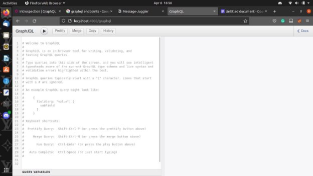
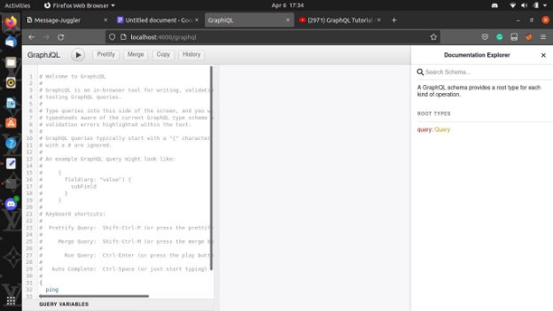
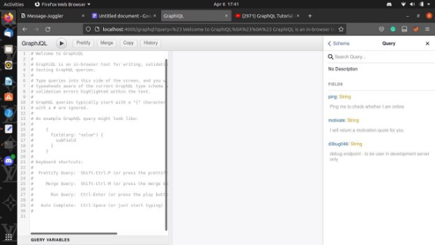
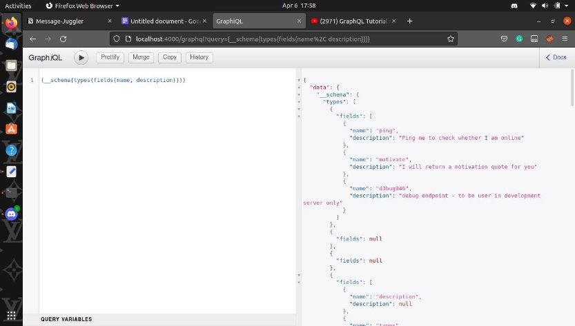
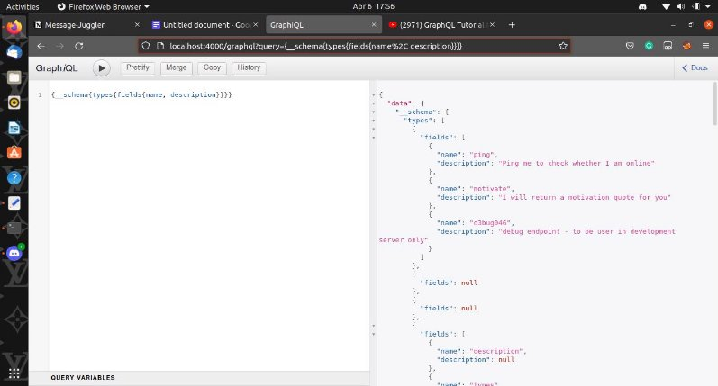
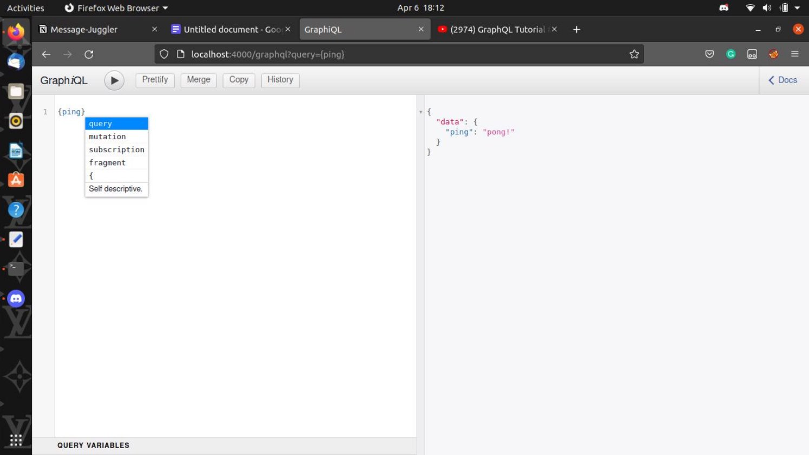
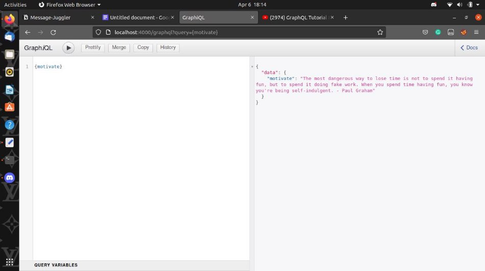
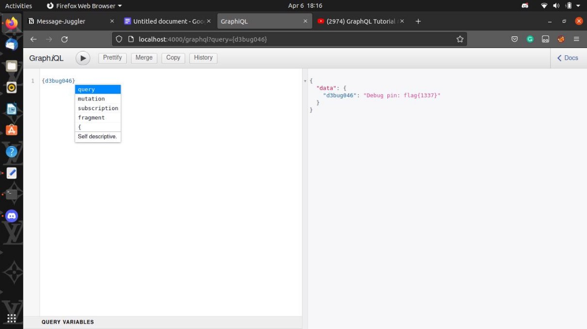

**GraphQL**

We are greeted with an in-browser tool for writing, validating, and testing GraphQL queries.

We can input queries toward the left side of the page and the desired output will be given out to the right side.

On opening “Docs” (aka Documentation Explorer) we can see that there is a root type in this specific schema.

On Further expanding the “Query” segment of the root types we find that there are three more fields to this root type namely:

- ping
- motivate
- d3bug046

Each with a specific description of what is exactly their function.

From here we can construct a query to find the endpoints of the current schema and this query can be entered from two places:

1. In the URL via the address bar.
1. The query editor on the webpage.

We can easily construct a payload or query in GraphQl by using the entry point to find the endpoint as the “**\_\_schema**”

(In GraphQl it is mandatory to use braces ’{}’ while creating our query)

Now after opening the entry point (“\_\_schema”) we will use “**types**” and “**fields**” to concat data such as the name and the description.

**PAYLOAD**(on the webpage)**:** {

\_\_schema{

types{ 

fields{name, description} }

}

}

**PAYLOAD**(for the URL)**:**

<URL> /graphql?query={\_\_schema{types{fields{name%2C description}}}}

After which we will be presented with the following output:

This query basically gives us all the names and descriptions of the fields that are present in the particular schema.

Now while going through the output we find that there are three such fields that have descriptions where the third field or “**d3bug046**” allows us to request toward the endpoint.

Therefore let's proceed by inputting each of the fields as the query to request a reply from the server.

- ping **PAYLOAD:**{ping}
- motivate **PAYLOAD:{**motivate}
- d3bug046 **PAYLOAD:**{d3bug046}

When we input “**{d3bug046}**” as the payload for which we get the flag in the form of a debug pin.
